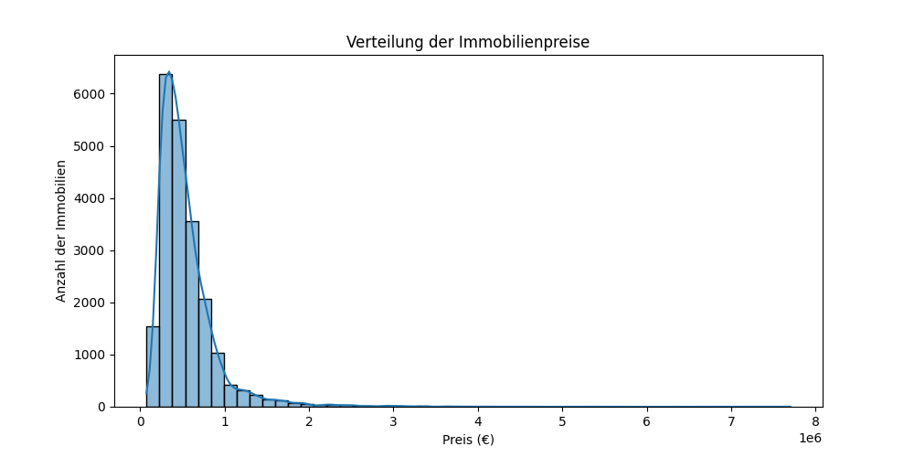
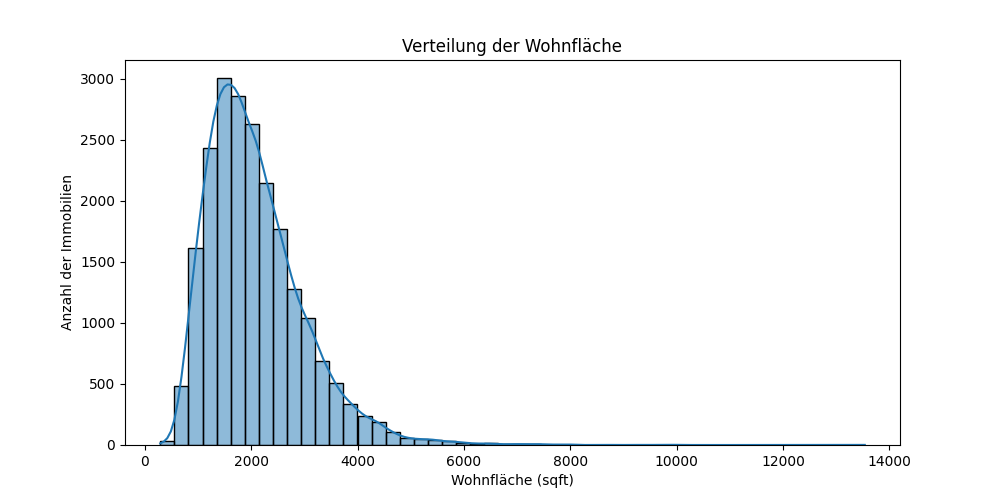
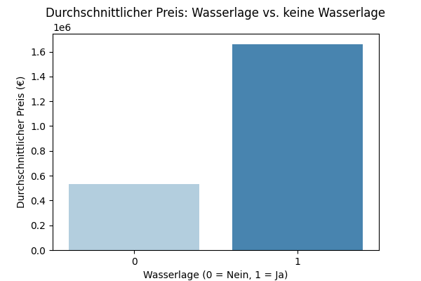
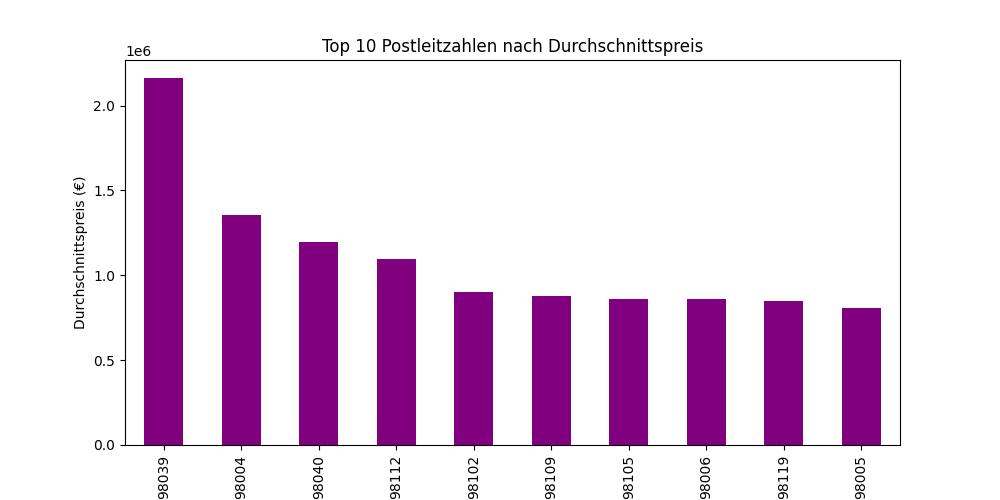
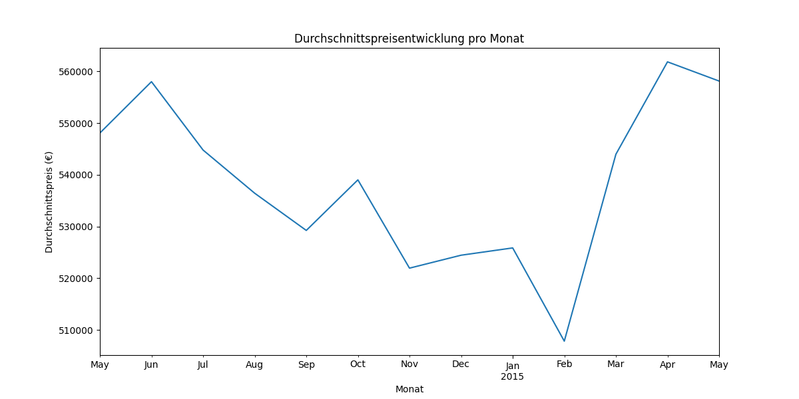

# 🏠 King County Housing Analysis – Immobilienpreise in Seattle

Dieses Projekt untersucht die Verkaufspreise von Häusern im Raum Seattle (King County, USA).  
Ziel ist es, **die wichtigsten Einflussfaktoren auf Immobilienpreise** zu identifizieren und visuell darzustellen.

---

## 🚀 Ziel des Projekts
- Welche **Faktoren bestimmen den Preis einer Immobilie** (Wohnfläche, Baujahr, Wasserlage)?
- **Welche Regionen (Postleitzahlen) sind besonders teuer?**
- **Wie entwickeln sich die Preise über die Zeit?**

---

## 📂 Projektstruktur
- `data/` – Rohdaten (`kc_house_data.csv`)
- `notebooks/` – Explorative Datenanalyse (`king_county_analysis.ipynb`)
- `visuals/` – Diagramme & Plots
- `scripts/` – Python-Skripte (optional)

---

## 📊 Ergebnisse (Auswahl)

### 🔸 Verteilung der Immobilienpreise
- **Typischer Preis: ~450.000 € (Median)**,  
- **Durchschnitt: ~540.000 €** → **Luxusimmobilien ziehen den Schnitt nach oben**.
- **Große Preisspanne: 75.000 € bis 7,7 Mio €**.

📊 **Visualisierung:**  


---

### 🔸 Wohnfläche (sqft_living) – Verteilung
- **Typische Wohnfläche: ~178 m² (Median)**.
- **Spanne: Tiny Houses (~27 m²) bis Villen (~1.250 m²)**.

📊 **Visualisierung:**  


---

### 🔸 Wasserlage (waterfront) vs. Preis
- **Häuser mit Wasserlage kosten im Schnitt 1,66 Mio €**.
- **Ohne Wasserlage: ~531.000 €** → **Wasserlage verdreifacht den Preis!**

📊 **Visualisierung:**  


---

### 🔸 Teure Postleitzahlen (Hotspots)
- **Medina (98039): ~2,16 Mio € Durchschnittspreis** → **Wohnort von Bill Gates**.
- **Bellevue, Mercer Island & Queen Anne** gehören zu den teuersten Lagen.

📊 **Visualisierung:**  


---

### 🔸 Preisentwicklung über die Zeit
- **Saisonale Schwankungen erkennbar**:  
  **Winterdelle → Frühjahrsanstieg** im Jahr 2015.
- **Frühjahr 2015: Neuer Höchststand der Preise (~560.000 €)**.

📊 **Visualisierung:**  


---

## 📦 Installation & Nutzung
Falls du die Analyse lokal nachverfolgen willst:

```bash
pip install pandas matplotlib seaborn jupyter
jupyter notebook notebooks/king_county_analysis.ipynb
```

---

## 📊 Datenquelle
Die Daten stammen von **Kaggle**:  
🔗 [House Sales in King County, USA – Kaggle](https://www.kaggle.com/datasets/harlfoxem/housesalesprediction)

---

## 🧑‍💻 Kontakt
Projekt erstellt von **Tim Schulz-Eppers** als **persönliches Data-Analytics-Referenzprojekt**.  
Bei Fragen oder Feedback gerne über **GitHub** oder **LinkedIn** kontaktieren.
